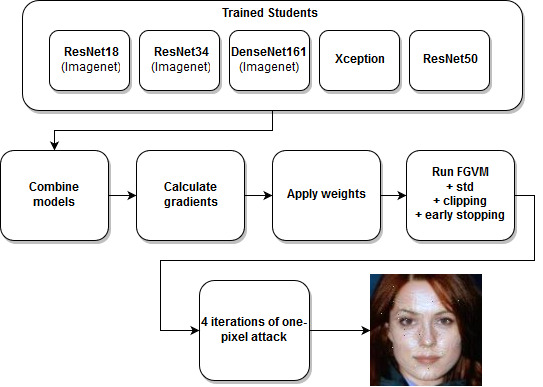
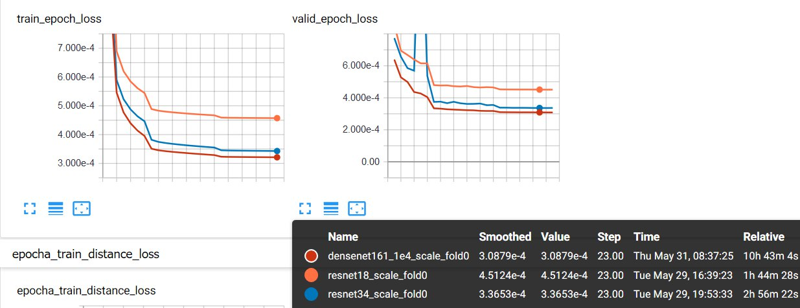

# 1. Build docker image

To build the docker image from the Dockerfile located in `dockerfile` please do:
```
cd dockerfile
docker build -t atmyra_docker .
```

Also please make sure that [nvidia-docker2](https://github.com/nvidia/nvidia-docker/wiki/Installation-(version-2.0)) and proper nvidia drivers are installed.

To test the installation run
```
docker run --runtime=nvidia --rm nvidia/cuda nvidia-smi
```

Then launch the container as follows:
```
docker run --runtime=nvidia -e NVIDIA_VISIBLE_DEVICES=all -it -v /your/folder/:/home/keras/notebook/your_folder -p 8888:8888 -p 6006:6006 --name atmyra --shm-size 16G atmyra_docker
```

Please note that w/o `--shm-size 16G` PyTorch dataloader classes will not work.
The above command will start a container with a Jupyter notebook server available via port `8888`. 
Port `6006` is for tensorboard, if necessary.

Then you can exec into the container like this. All the scripts were run as root, but they must also work under user `keras`
```
docker exec -it --user root 46b9bd3fa3f8 /bin/bash
```
or
```
docker exec -it --user keras 46b9bd3fa3f8 /bin/bash
```

To find out the container ID run
```
 docker container ls
```

# 2. Data structure and preparation

Download this [version](mcs2018-competition.visionlabs.ru/distribs/test/MCS2018.cpython-35m-x86_64-linux-gnu.so) of the black box into the folder

This is the version for
- Ubuntu 16.04
- Python 3.5
- CUDA 9.0

Backup [link](https://drive.google.com/open?id=1qXOfI-uZi2uw8ZlVZnQV_DzzVE-KmNbN) for the source file

It is assumed that data is stored in `/data`

The following files are required 
- `data/pairs_list.csv`
- `data/img_list_1M.csv` - list with 1M images
- `data/img_descriptors_1M.npy` - numpy array with 1M descriptors
- `data/student_model_imgs` - a folder with 1M images
- `data/imgs` - a folder with original attack images

The following pre-trained model files are to be located in the followind folders
- `student_net_learning/checkpoint/resnet34_scale_fold0_best.pth.tar`
- `student_net_learning/checkpoint/ResNet50/best_model_chkpt.t7`
- `student_net_learning/checkpoint/Xception/best_model_chkpt.t7`
- `student_net_learning/checkpoint/resnet18_scale_fold0_best.pth.tar`
- `student_net_learning/checkpoint/densenet161_1e4_scale_fold0_best.pth.tar`


To download the **pre-trained weights** you can use the following links:
- [DenseNet169](https://drive.google.com/open?id=1STT7CIKY8k3k_6RvRX1vop1HEF4A5EEP)
- [ResNet34](https://drive.google.com/open?id=17z5p02kBePmyzyPxdWaHyCb6CVHhMXbe)
- [ResNet18](https://drive.google.com/open?id=1K5zBBxYRzFDqPQqGQ15Lo4vjrexwVtM1)
- [ResNet50](https://drive.google.com/open?id=1dYp6mATDa8ObQVwu1HzHK6U6pzHn9sPz)
- [Xception](https://drive.google.com/open?id=1cVwP765K3DzTRzaEBr_fMf9bqjtYIz7w)


# 3. Run attack inference

**After all of the above preparations, run the following scripts:**

```
python attacker.py --root ./data/imgs/ --save_root ./dual_net_new/ --datalist ./data/pairs_list.csv --start_from 0 --attack_type IFGM \
--model_name resnet34 ResNet50 Xception resnet18 densenet161 \
--checkpoint \
student_net_learning/checkpoint/resnet34_scale_fold0_best.pth.tar \
student_net_learning/checkpoint/ResNet50/best_model_chkpt-resnet50.t7 \
student_net_learning/checkpoint/Xception/best_model_chkpt-xception.t7 \
student_net_learning/checkpoint/resnet18_scale_fold0_best.pth.tar \
student_net_learning/checkpoint/densenet161_1e4_scale_fold0_best.pth.tar --cuda
```
Please note that full inference may take 30+ hours, therefore the easiest way to speed up the script is to run it in several threads using `--start_from 0` parameter
Then
```
python attacker.py --root ./dual_net_new --save_root ./dual_net_new_op/ \
--datalist ./data/pairs_list.csv --cuda --start_from 0 --attack_mode continue --attack_type OnePixel
```
Then
```
python attacker.py --root ./dual_net_new_op --save_root ./dual_net_new_op_5/ \
--datalist ./data/pairs_list.csv --cuda --start_from 0 --attack_mode continue --attack_type OnePixel --iter 5
```
Then
```
python attacker.py --root ./dual_net_new_op_5 --save_root ./dual_net_new_op_15/ \
--datalist ./data/pairs_list.csv --cuda --start_from 0 --attack_mode continue --attack_type OnePixel --iter 10
```
Then
```
python attacker.py --root ./dual_net_new_op_15 --save_root ./FINAL_FINAL/ \
--datalist ./data/pairs_list.csv --cuda --start_from 0 --attack_mode continue --attack_type OnePixel-last-hope --iter 5
```
Then
```
python evaluate.py --attack_root ./FINAL_FINAL/ --target_dscr ./data/val_descriptors.npy --submit_name final_final --gpu_id 0
```

# 4. Train snakers41's CNNs

## Prepare the data
First `cd av_cnns`


Then make sure that the following files and folders are available via the following relative paths
- `./data/img_list_1M.csv` - list with 1M images
- `../data/img_descriptors_1M.npy` - numpy array with 1M descriptors
- `../data/student_model_imgs` - a folder with 1M images

## Train models

Then copy the following scripts one by one to a `run.sh` file and run `sh run.sh`
To view TensorBoard logs you need to enable TensorBoard via
```
tensorboard --logdir='path/to/av_cnns/tb_logs' --port=6006
```

The weights will be saved to `weights/`
Alternatively you can run all the scripts as one file

**Densenet**
```
python3 distill_network.py \
	--arch densenet161 --lognumber densenet161_1e4_scale \
	--epochs 25 --start-epoch 0 \
	--batch-size 256 --workers 10 \
	--val_size 0.1 --do_augs False \
	--lr 1e-4 --ths 1e-2 \
	--m1 5 --m2 15 \
	--optimizer adam --print-freq 10 \
	--tensorboard True \
```
**ResNet34**
```
python3 distill_network.py \
	--arch resnet18 --lognumber resnet18_scale \
	--epochs 25 --start-epoch 0 \
	--batch-size 512 --workers 10 \
	--val_size 0.1 --do_augs False \
	--lr 1e-3 --ths 1e-2 \
	--m1 5 --m2 15 \
	--optimizer adam --print-freq 10 \
	--tensorboard True \
```

**ResNet18**
```
python3 distill_network.py \
	--arch resnet34 --lognumber resnet34_scale \
	--epochs 25 --start-epoch 0 \
	--batch-size 512 --workers 10 \
	--val_size 0.1 --do_augs False \
	--lr 1e-3 --ths 1e-2 \
	--m1 5 --m2 15 \
	--optimizer adam --print-freq 10 \
	--tensorboard True \
```

## Pre-trained weights
To download the **pre-trained weights** you can use the following links:
- [DenseNet169](https://drive.google.com/open?id=1STT7CIKY8k3k_6RvRX1vop1HEF4A5EEP)
- [ResNet34](https://drive.google.com/open?id=17z5p02kBePmyzyPxdWaHyCb6CVHhMXbe)
- [ResNet18](https://drive.google.com/open?id=1K5zBBxYRzFDqPQqGQ15Lo4vjrexwVtM1)


Also you can add a `-resume` flag to start from a checkpoint:
```
python3 distill_network.py \
	--arch resnet18 --lognumber resnet18_scale \
	--epochs 30 --start-epoch 0 \
	--batch-size 512 --workers 10 \
	--val_size 0.1 --do_augs False \
	--lr 1e-3 --ths 1e-2 \
	--m1 5 --m2 15 \
	--optimizer adam --print-freq 10 \
	--tensorboard True \
	--resume weights/your_weights.pth.tar
```

## Training time
With the above setting on 2x1080Ti training takes:
- 2 hours for ResNet18
- 3 hours for ResNet34
- 11 hours for DenseNet169




# 5. Train mortido's CNNs

Provided original script log w/o alterations
```

======================================
xception redesign
=====================================
python main.py --name Xception --model_name Xception --epochs 6 --down_epoch 2 --cuda --batch_size 64 --datalist ../data/data_list/ --root C:/ --lr 0.001 --finetune --criterion HUBER --resume --max_train_imgs 100000
python main.py --name Xception --model_name Xception --epochs 3 --down_epoch 1 --cuda --batch_size 64 --datalist ../data/data_list/ --root C:/ --lr 0.0001 --finetune --ignore_prev_run --resume --max_train_imgs 100000
python main.py --name Xception --model_name Xception --epochs 2 --down_epoch 1 --cuda --batch_size 64 --datalist ../data/data_list/ --root C:/ --lr 0.0001 --ignore_prev_run --resume --max_train_imgs 100000
(accidentely 3 epochs with frozen layers...)
python main.py --name Xception --model_name Xception --epochs 3 --down_epoch 2 --cuda --batch_size 64 --datalist ../data/data_list/ --root C:/ --lr 0.0001 --finetune --ignore_prev_run --resume --max_train_imgs 100000 
python main.py --name Xception --model_name Xception --epochs 1 --down_epoch 1 --cuda --batch_size 64 --datalist ../data/data_list/ --root C:/ --lr 0.0001 --ignore_prev_run --resume --max_train_imgs 100000
python main.py --name Xception --model_name Xception --epochs 1 --down_epoch 1 --cuda --batch_size 64 --datalist ../data/data_list/ --root C:/ --lr 0.0001 --ignore_prev_run --resume --max_train_imgs 500000
python main.py --name Xception --model_name Xception --epochs 2 --down_epoch 1 --cuda --batch_size 32 --datalist ../data/data_list/ --root C:/ --lr 0.0001 --ignore_prev_run --resume
python main.py --name Xception --model_name Xception --epochs 3 --down_epoch 1 --cuda --batch_size 32 --datalist ../data/data_list/ --root C:/ --lr 0.0005 --ignore_prev_run --resume
python main.py --name Xception --model_name Xception --epochs 2 --cuda --batch_size 32 --datalist ../data/data_list/ --root C:/ --lr 0.000005 --ignore_prev_run --resume
=========================
resnet50
=========================
python main.py --name ResNet50 --model_name ResNet50 --epochs 3 --down_epoch 1 --cuda --batch_size 16 --datalist ../data/data_list/ --root C:/ --lr 0.005 --max_train_imgs 10000
python main.py --name ResNet50 --model_name ResNet50 --epochs 3 --down_epoch 4 --cuda --batch_size 32 --datalist ../data/data_list/ --root C:/ --lr 0.0001 --ignore_prev_run --resume
python main.py --name ResNet50 --model_name ResNet50 --epochs 1 --down_epoch 4 --cuda --batch_size 32 --datalist ../data/data_list/ --root C:/ --lr 0.0001 --ignore_prev_run --resume
python main.py --name ResNet50 --model_name ResNet50 --epochs 1 --down_epoch 4 --cuda --batch_size 32 --datalist ../data/data_list/ --root C:/ --lr 0.00003 --ignore_prev_run --resume
python main.py --name ResNet50 --model_name ResNet50 --epochs 1 --down_epoch 4 --cuda --batch_size 32 --datalist ../data/data_list/ --root C:/ --lr 0.00001 --ignore_prev_run --resume
python main.py --name ResNet50 --model_name ResNet50 --epochs 1 --down_epoch 4 --cuda --batch_size 32 --datalist ../data/data_list/ --root C:/ --lr 0.000003 --ignore_prev_run --resume
python main.py --name ResNet50 --model_name ResNet50 --epochs 1 --down_epoch 4 --cuda --batch_size 32 --datalist ../data/data_list/ --root C:/ --lr 0.000001 --ignore_prev_run --resume
=========================
```